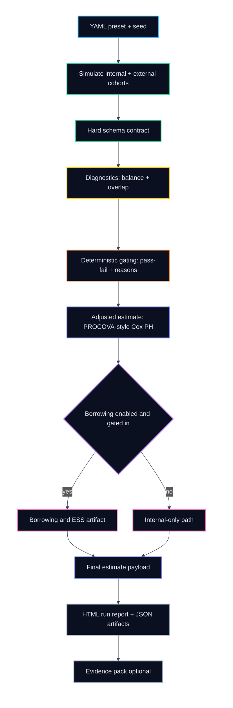

<p align="center">
  
</p>

# Twintafo Synthetic Data Generator — Public Documentation

Twintafo is a **regulated-style synthetic clinical data generator scaffold** producing **oncology-like cohorts** (baseline covariates, survival outcomes, longitudinal ctDNA) plus **review artifacts** (diagnostics, transportability gating, adjusted estimates, optional borrowing/ESS, and HTML reports).

> The implementation lives in a separate **private** repository.  
> This repo is intentionally **documentation-only** so others can evaluate the logic, methodology, and evidence without reproduction-grade details.

## Quick links
- **Start here**: [`docs/index.md`](docs/index.md)
- **Executive summary**: [`docs/executive-summary.md`](docs/executive-summary.md)
- **Outputs contract**: [`docs/outputs/artifacts.md`](docs/outputs/artifacts.md)
- **Pipeline & decision flow**: [`docs/how-it-works/pipeline.md`](docs/how-it-works/pipeline.md)
- **Transportability & gating**: [`docs/how-it-works/gating.md`](docs/how-it-works/gating.md)
- **Validation (OC + sensitivity)**: [`docs/validity/overview.md`](docs/validity/overview.md)
- **Privacy claims / non-claims**: [`docs/privacy/claims.md`](docs/privacy/claims.md)

## At a glance (pipeline)


## What you can evaluate from this repo
- **Artifact contract**: what files exist, what they mean, how they fit together
- **Decision logic (public view)**: diagnostics → gating → estimate → optional borrowing → reporting
- **Validation methodology**: operating characteristics and sensitivity sweeps for decision behavior
- **Explicit boundaries**: what we do and do not claim publicly

## Disclosure boundaries (public vs private)
- **We share**: goals, assumptions, artifact contracts, evaluation methodology, and aggregate summaries.
- **We may share**: toy examples and screenshots of reports where safe.
- **We do NOT share**: reproduction-critical recipes (exact simulation dynamics, tuning defaults, internal fallbacks) or anything enabling a competitor to rebuild quickly.

## Preview the docs site locally
This repo is structured as a small docs site using MkDocs + Material.

```bash
python3 -m venv .venv
source .venv/bin/activate
pip install -r requirements.txt
mkdocs serve
```

## Contact
If you’re evaluating Twintafo and need deeper technical access under NDA, this documentation is the starting point.
